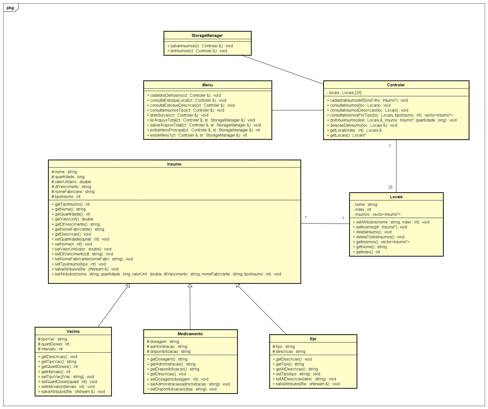

# Moderator Health Supplies 
This project seeks to create a system for the management of supplies for Covid-19

## 1. Project objectives:

Attempting to explore the public health sector demmand, the project uses concepts of OOP in C++

To study data structure, primitive software engineering and mainly object orientation.

## 2. Project diagram:

The diagram preserves the system fucionality. Then, you can find this same schema in UI implamentation:



## 3. How to execute the prompt system:

Clone the project in branch master:

```
git clone --branch master https://github.com/JoaquimBreno/modhealthsupplies.git
```

In case you have GCC/G++ and make Unix tool, run command:

```
make
```
